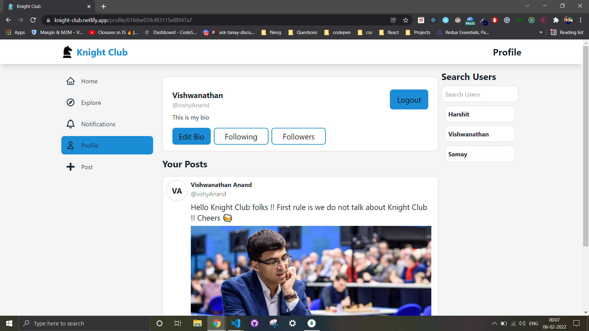

# Knight Club

A social media app for chess lovers to discuss chess games and strategies. 

### Preview



Deployed app: [https://knight-club.netlify.app](https://knight-club.netlify.app)

Backend source code (Express & Mongoose): [https://github.com/harshitbadollacodes/chessMedia_BE](https://github.com/harshitbadollacodes/chessMedia_BE)

### Tech Stack: 
- **React.js** : v17.0.2
- **React router**: v6.2.1
- **Express**
- **Axios** : v0.25.0
- **Tailwind**: v3.0.18
- **Cloudinary**

### Features
1. Create Post
2. Upload images in posts
3. Auth: Log in and Sign up
4. Private and public routes: Private routes accessible only on login
5. Like & save posts
6. Follow/Unfollow Users 
7. View user profile,
8. Edit Bio
9. Responsive design
10. Local storage persistence of auth state

Bootstrapped with `create-react-app`

## Run Locally

#### Get started

1. **Clone the repo:**
```bash
  $ git clone https://github.com/harshitbadollacodes/chess_media.git
```
2. **Install required node modules:**
```bash
  $ npm install
```
3. **Start the dev server:**
```bash
  $ npm start
```
Open the `localhost` link in the browser.
Happy hacking!       

## 🔗 Links
[](https://twitter.com/harshit_badolla)

[](https://www.linkedin.com/in/harshit-badolla-b96b75229/)

